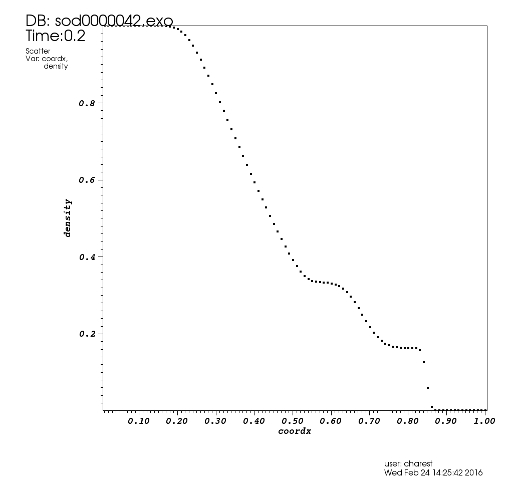

# Summary

This is a *hopefully* parallel unstructured solver infrastructure for
devlopping multi-physics simulations. The plan is to support 2D and 3D
arbitrary polyhedral meshes distributed over hundreds to thousands of
nodes. The code is built upon
[FleCSI](https://github.com/flecsi/flecsi), an open source general
purpose set of tools for execution and state control.

Right now most new developpers should focus on building tests in the
`src` directory to excersize different functionality.  See the
[README](src) on building library functionality and tests. Developpers
can also start by creating their own apps using this [README](apps).

---

# Current Status




---

# Thirdparty Libraries

This project uses a number of third party libraries.  Below is a list
of the required thirdparty libraries and their respective
dependants. The library dependency graph is as follows:

- [Cinch](https://github.com/losalamos/cinch) - A set of utilities and
  configuration options to simplify [CMake](https://cmake.org/)
  configuration.
  
  
- [FleCSI](https://github.com/flecsi/flecsi) - For mesh/state and
  execution control. 
    - [METIS](http://glaros.dtc.umn.edu/gkhome/metis/metis/overview) -
      A graph partitioner
      
    - [Scotch](https://www.labri.fr/perso/pelegrin/scotch/) - A graph
      partitioner
      
    - [ExodusII](https://sourceforge.net/projects/exodusii/) - A
      finite-element data file format
        - [NetCDF](http://www.unidata.ucar.edu/software/netcdf/) -
          Provides machine-independant file formats
            - [HDF5](https://www.hdfgroup.org/HDF5/) - A data model and
              file format


---

# Getting the ALE Project Source

This project uses [Git](https://git-scm.com/) for revision control and
distribution, and [CMake](https://cmake.org/) for build configuration.
Below are some general instructions for obtaining and building ALE.

To clone the repository, type

    git clone --recursive ssh://git@xcp-stash.lanl.gov:7999/ngc/ale.git
    
**Make sure to include the `--recursive` so that all of the
submodules are cloned as well.** 


---

# <a name="simple"></a> Simple Installation

To make building the code simpler, the thirdparty libraries have
already been downloaded and installed for you on some LANL machines.
Currently the simple installation process is avaliable on
[darwin](darwin.lanl.gov) and moonlight. All you need to do is
compiler the ALE source.  Fist, create a build directory somewhere, run the
cmake configure script, then make the code.  This is performed by
executing the following commands:

    mkdir build
    cd build
    <ALE_DIR>/arch/<MACHINE>/cmake-ale.sh gcc
    make -j

where `<ALE_DIR>` is the location of the cloned ALE git
repository and `<MACHINE>` is the LANL machine you are using.
Right now `<MACHINE>` can be one of **darwin** or **moonlight**.
This command will use the gcc compilers to build the code.


---

# Advanced Installation

The advanced installation lets users build they're own thirdparty
libraries if they want.  This is a three step process:  1) downloading
the thirdparty libraries; 2) building the thirdparty
libraries; and 3) compiling the final ALE project.  To start,
create seperate build directories as follows:

    mkdir build          # main build directory
    mkdir -p build/files # thirdparty tarball directory
    mkdir -p build/tpl   # thirdparty build directory
    mkdir -p build/ale   # ale build directory
    ls build
    $ ale files tpl 


## 1. Obtaining the Thirdparty Libraries (optional)

If you already have the necessary libraries in a folder somewhere, you
can skip this step.  For example, they have already been downloaded
for you on the LANL machines described in the
[Simple Installation](#simple) section.  The build system can also
download them for you.  To download the files to `build/files`

    cd build/files
    TPL_DOWNLOAD_PATH=. <ALE_DIR>/arch/download-tpl.sh


## 2. Build the Thirdparty Libraries

Build them using the following commands: 

    cd ../tpl
    TPL_INSTALL_PREFIX=./install TPL_DOWNLOAD_PATH=../files <ALE_DIR>/arch/<MACHINE>/cmake-tpl.sh gcc
    make -j
    
You do not need to provide `TPL_DOWNLOAD_PATH=../files` if you skipped
the previous step in the advanced installation process.


## 2. Build the ALE Project

Now build the final ALE project.  Execute the following:

    cd ../ale
    TPL_INSTALL_PREFIX=../tpl/install <ALE_DIR>/arch/<MACHINE>/cmake-ale.sh gcc
    make -j
    
You do not have to rebuild the thirdparty libraries if you make
changes to the ALE source code in `<ALE_DIR>`.  Simply recompile the
ALE source using the make command:

    cd build/ale
    make -j


---

# Code Structure

The directory structure is layed out as follows:

```
root
├───apps
│   Applications that make use of the ALE library.
│
├───arch
│   CMake configuration scripts for the overall project.
│
├───config
│   Cinch configuration files.
│
├───doc
│   Project documention.
│
├───examples
│   Example full applications that utilize the fullALE/FlecSI library (not completed yet!).
│
├───src
│   The main ALE project source code to construct the ALE library.
│
└───thirdparty
    CMake configuration scripts for building the thirdparty libraries.
```
